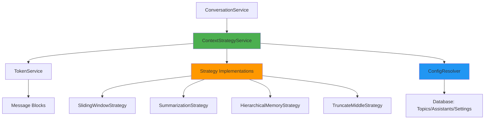

# Context Management System - Mobile Port Architecture Plan

## Executive Summary

This document outlines the architectural plan for porting Cherry Studio's desktop context management system to the mobile app. The system prevents "input too large" errors by intelligently managing conversation context through 4 strategic approaches while maintaining conversation quality and continuity.

## 1. Architecture Overview

### 1.1 System Goals

1. **Prevent token limit errors** - Automatically manage context to stay within model limits
2. **Preserve conversation quality** - Maintain important context and continuity
3. **Support multiple strategies** - Offer 4 different context management approaches
4. **Configuration flexibility** - Three-tier override system (Global → Assistant → Topic)
5. **Handle all token sources** - Messages, files, web search, tools, system prompts

### 1.2 Core Components



### 1.3 Data Flow

```
User sends message
    ↓
ConversationService.prepareMessagesForModel()
    ↓
ContextStrategyService.applyContextStrategy()
    ↓
ConfigResolver.getEffectiveStrategyConfig()  (Topic → Assistant → Global)
    ↓
TokenService.calculateRemainingBudget()
    ↓
[If over budget] → Strategy.apply()
    ↓
    ├─ Estimate tokens per message
    ├─ Apply strategy-specific logic
    ├─ Return filtered messages + metadata
    └─ Optional: Generate summary/facts
    ↓
convertMessagesToSdkMessages()
    ↓
Send to LLM Provider
```

## 2. File Structure

```
src/services/contextStrategies/
├── index.ts                          # Main entry point & orchestration
├── types.ts                          # Type definitions & base class
├── configResolver.ts                 # Configuration hierarchy resolution
├── strategies/
│   ├── SlidingWindowStrategy.ts      # Keep recent messages
│   ├── SummarizationStrategy.ts      # Progressively summarize older
│   ├── HierarchicalMemoryStrategy.ts # 3-tier memory system
│   └── TruncateMiddleStrategy.ts     # Keep first + last
└── __tests__/
    ├── strategies.test.ts            # Strategy unit tests
    └── integration.test.ts           # End-to-end tests

src/services/
├── TokenService.ts                   # Enhanced with context estimation
└── ConversationService.ts            # Integrated with context strategies

src/types/
├── contextStrategy.ts                # Context strategy types
└── message.ts                        # Enhanced Message types

db/schema/
├── topics.ts                         # Add contextStrategy field
├── assistants.ts                     # Add contextStrategy field
└── settings.ts                       # Add contextStrategy field (in settings JSON)
```

## 3. Type Definitions

### 3.1 Core Types

```typescript
// src/types/contextStrategy.ts

export type ContextStrategyType = 
  | 'none'              // Disabled
  | 'sliding_window'    // Keep recent messages
  | 'summarize'         // Progressive summarization
  | 'hierarchical'      // 3-tier memory
  | 'truncate_middle'   // Keep first + last

export interface ContextStrategyConfig {
  // Strategy type
  type: ContextStrategyType
  
  // Sliding Window options
  maxMessages?: number                  // Max message count to keep
  
  // Summarization options
  summarizeThreshold?: number           // Min messages before summarizing (default: 6)
  summaryMaxTokens?: number            // Max tokens for summary (default: 500)
  summarizationModelId?: string        // Model ID for summarization
  
  // Hierarchical Memory options
  shortTermTurns?: number              // Recent turns kept verbatim (default: 5)
  midTermSummaryTokens?: number        // Budget for mid-term summary (default: 2000)
  longTermFactsTokens?: number         // Budget for long-term facts (default: 500)
  
  // Truncate Middle options
  keepFirstMessages?: number           // Messages to keep from start (default: 2)
  keepLastMessages?: number            // Messages to keep from end (default: 4)
  showOmissionMarker?: boolean         // Show "[...messages omitted...]" (default: true)
}

export const DEFAULT_CONTEXT_STRATEGY_CONFIG: ContextStrategyConfig = {
  type: 'none',
  maxMessages: 20,
  summarizeThreshold: 6,
  summaryMaxTokens: 500,
  shortTermTurns: 5,
  midTermSummaryTokens: 2000,
  longTermFactsTokens: 500,
  keepFirstMessages: 2,
  keepLastMessages: 4,
  showOmissionMarker: true
}

export interface ContextStrategyContext {
  model: Model
  tokenBudget: number                  // Available tokens for input
  currentTokens: number                // Current usage
  systemPrompt?: string                // System prompt text
  topicId?: string                     // Current topic
  existingSummary?: string             // Existing summary to extend
  existingFacts?: string[]             // Existing facts to merge
}

export interface ContextStrategyResult {
  messages: Message[]                  // Processed messages
  summary?: string                     // Generated summary (for context)
  extractedFacts?: string[]            // Extracted long-term facts
  messagesRemoved: number              // Count of removed messages
  tokensSaved: number                  // Tokens saved
  wasApplied: boolean                  // Whether strategy was applied
}

export interface ContextStrategy {
  readonly name: ContextStrategyType
  readonly description: string
  apply(
    messages: Message[],
    config: ContextStrategyConfig,
    context: ContextStrategyContext
  ): Promise<ContextStrategyResult>
}
```

### 3.2 Database Schema Extensions

```typescript
// db/schema/topics.ts - Add field
export const topics = sqliteTable('topics', {
  // ... existing fields ...
  context_strategy: text('context_strategy'), // JSON: Partial<ContextStrategyConfig>
  context_summary: text('context_summary'),   // Cached summary
  context_facts: text('context_facts'),       // JSON: string[] - cached facts
})

// db/schema/assistants.ts - Add to settings JSON
export interface AssistantSettings {
  // ... existing fields ...
  contextStrategy?: Partial<ContextStrategyConfig>
}

// src/types/preference.ts - Add to global settings
export interface AppPreferences {
  // ... existing fields ...
  contextStrategy?: ContextStrategyConfig
  contextSummarizationModelId?: string  // Model for summarization
}
```

## 4. Implementation Details

### 4.1 TokenService Enhancements

**Status**: Already implemented in mobile app ✅

The mobile app's `TokenService.ts` already has:
- `estimateSingleMessageTokens()` - Handles all block types
- `estimateConversationTokens()` - Includes system prompt
- `calculateRemainingBudget()` - Full budget calculation
- Support for images, files, tools, citations, etc.

**Minor additions needed**:
```typescript
// Add to TokenService.ts

/**
 * Calculate token budget breakdown for context management
 */
export function getContextBudgetBreakdown(
  model: Model,
  messages: Message[],
  systemPrompt?: string,
  maxOutputTokens?: number
): {
  modelLimit: number
  effectiveBudget: number          // With safety margin
  systemPromptTokens: number
  maxOutputTokens: number
  availableForMessages: number     // Remaining for messages
  currentMessageTokens: number
  isOverBudget: boolean
  overBudgetBy: number
} {
  const modelLimit = getModelContextLimit(model)
  const effectiveBudget = getEffectiveContextBudget(model)
  const systemPromptTokens = systemPrompt ? estimateTextTokens(systemPrompt) : 0
  const outputBudget = maxOutputTokens || MIN_RESPONSE_TOKEN_BUDGET
  const availableForMessages = effectiveBudget - systemPromptTokens - outputBudget
  const currentMessageTokens = estimateMessagesTokens(messages)
  const isOverBudget = currentMessageTokens > availableForMessages
  
  return {
    modelLimit,
    effectiveBudget,
    systemPromptTokens,
    maxOutputTokens: outputBudget,
    availableForMessages,
    currentMessageTokens,
    isOverBudget,
    overBudgetBy: isOverBudget ? currentMessageTokens - availableForMessages : 0
  }
}
```

### 4.2 Strategy Implementations

Each strategy follows the same pattern:

```typescript
// Base class pattern
export abstract class BaseContextStrategy implements ContextStrategy {
  abstract readonly name: ContextStrategy['name']
  abstract readonly description: string

  abstract apply(
    messages: Message[],
    config: ContextStrategyConfig,
    context: ContextStrategyContext
  ): Promise<ContextStrategyResult>

  protected noOpResult(messages: Message[]): ContextStrategyResult {
    return {
      messages,
      messagesRemoved: 0,
      tokensSaved: 0,
      wasApplied: false
    }
  }

  protected shouldApply(context: ContextStrategyContext): boolean {
    return context.currentTokens > context.tokenBudget
  }
}
```

#### 4.2.1 Sliding Window Strategy

**Simplest approach** - Keeps most recent messages that fit.

```typescript
export class SlidingWindowStrategy extends BaseContextStrategy {
  readonly name = 'sliding_window' as const
  
  async apply(messages, config, context) {
    if (!this.shouldApply(context)) return this.noOpResult(messages)
    
    // Work backwards from newest
    const kept: Message[] = []
    let tokens = 0
    const budget = context.tokenBudget - (context.systemPrompt ? estimateTextTokens(context.systemPrompt) : 0)
    
    for (let i = messages.length - 1; i >= 0; i--) {
      const msgTokens = estimateSingleMessageTokens(messages[i])
      if (tokens + msgTokens <= budget && (!config.maxMessages || kept.length < config.maxMessages)) {
        kept.unshift(messages[i])
        tokens += msgTokens
      }
    }
    
    return {
      messages: this.ensureUserMessageFirst(kept),
      messagesRemoved: messages.length - kept.length,
      tokensSaved: context.currentTokens - tokens,
      wasApplied: true
    }
  }
}
```

#### 4.2.2 Summarization Strategy

**Progressive compression** - Summarize older messages.

```typescript
export class SummarizationStrategy extends BaseContextStrategy {
  readonly name = 'summarize' as const
  
  async apply(messages, config, context) {
    // Check threshold
    if (messages.length < (config.summarizeThreshold || 6)) {
      return this.fallbackToSlidingWindow(messages, config, context)
    }
    
    // Split: recent vs to-summarize
    const { recentMessages, toSummarize } = this.splitMessages(messages, context)
    
    if (toSummarize.length === 0) return this.noOpResult(messages)
    
    // Generate/extend summary
    const summary = context.existingSummary 
      ? await this.extendSummary(context.existingSummary, toSummarize, config)
      : await this.generateSummary(toSummarize, config)
    
    return {
      messages: this.ensureUserMessageFirst(recentMessages),
      summary,
      messagesRemoved: toSummarize.length,
      tokensSaved: /* calculate */,
      wasApplied: true
    }
  }
  
  private async generateSummary(messages: Message[], config: ContextStrategyConfig): Promise<string> {
    // For Phase 1: Simple extractive summary
    // For Phase 2: LLM-based summarization using config.summarizationModelId
    return this.createExtractiveSummary(messages)
  }
}
```

#### 4.2.3 Hierarchical Memory Strategy

**3-tier system** - Short-term (verbatim) + Mid-term (summaries) + Long-term (facts).

```typescript
export class HierarchicalMemoryStrategy extends BaseContextStrategy {
  readonly name = 'hierarchical' as const
  
  async apply(messages, config, context) {
    const tiers = await this.buildMemoryTiers(messages, {
      shortTermTurns: config.shortTermTurns || 5,
      midTermBudget: config.midTermSummaryTokens || 2000,
      longTermBudget: config.longTermFactsTokens || 500,
      existingFacts: context.existingFacts,
      existingSummary: context.existingSummary
    })
    
    // Combine all tiers
    const combinedSummary = this.buildCombinedContext(tiers)
    
    return {
      messages: tiers.shortTerm,
      summary: combinedSummary,
      extractedFacts: tiers.longTermFacts,
      messagesRemoved: messages.length - tiers.shortTerm.length,
      tokensSaved: /* calculate */,
      wasApplied: true
    }
  }
}
```

#### 4.2.4 Truncate Middle Strategy

**Research-based** - Keep first + last (LLMs focus on ends).

```typescript
export class TruncateMiddleStrategy extends BaseContextStrategy {
  readonly name = 'truncate_middle' as const
  
  async apply(messages, config, context) {
    const keepFirst = config.keepFirstMessages || 2
    const keepLast = config.keepLastMessages || 4
    
    if (messages.length <= keepFirst + keepLast) {
      return this.fallbackToSlidingWindow(messages, config, context)
    }
    
    const first = messages.slice(0, keepFirst)
    const last = messages.slice(-keepLast)
    const removed = messages.slice(keepFirst, -keepLast)
    
    const summary = config.showOmissionMarker 
      ? '[Note: Some messages omitted to fit context limits]'
      : undefined
    
    return {
      messages: [...first, ...last],
      summary,
      messagesRemoved: removed.length,
      tokensSaved: /* calculate */,
      wasApplied: true
    }
  }
}
```

### 4.3 Configuration Resolution

```typescript
// src/services/contextStrategies/configResolver.ts

export function getEffectiveStrategyConfig(
  topic?: Topic,
  assistant?: Assistant,
  globalSettings?: AppPreferences
): ContextStrategyConfig {
  // Start with defaults
  let config = { ...DEFAULT_CONTEXT_STRATEGY_CONFIG }
  
  // Layer 1: Global settings
  if (globalSettings?.contextStrategy) {
    config = mergeConfigs(config, globalSettings.contextStrategy)
  }
  
  // Layer 2: Assistant settings
  if (assistant?.settings?.contextStrategy) {
    config = mergeConfigs(config, assistant.settings.contextStrategy)
  }
  
  // Layer 3: Topic settings (highest priority)
  if (topic?.contextStrategy) {
    config = mergeConfigs(config, topic.contextStrategy)
  }
  
  return config
}

function mergeConfigs(
  base: ContextStrategyConfig, 
  override: Partial<ContextStrategyConfig>
): ContextStrategyConfig {
  const merged = { ...base }
  
  for (const [key, value] of Object.entries(override)) {
    if (value !== undefined) {
      (merged as any)[key] = value
    }
  }
  
  return merged
}
```

### 4.4 Integration with ConversationService

```typescript
// src/services/ConversationService.ts - Enhanced

export class ConversationService {
  static async prepareMessagesForModel(
    messages: Message[],
    assistant: Assistant,
    topic?: Topic
  ): Promise<{ modelMessages: ModelMessage[]; uiMessages: Message[] }> {
    const { contextCount } = getAssistantSettings(assistant)
    
    // Apply existing filtering pipeline
    let uiMessages = ConversationService.filterMessagesPipeline(messages, contextCount)
    
    // NEW: Apply context strategy if enabled
    const model = assistant.model || getDefaultModel()
    const contextResult = await applyContextStrategy(
      uiMessages,
      model,
      {
        topic,
        assistant,
        systemPrompt: assistant.prompt,
        maxOutputTokens: assistant.settings?.maxTokens
      }
    )
    
    if (contextResult.wasApplied) {
      logger.info('Context strategy applied', {
        strategy: contextResult.strategy,
        removed: contextResult.messagesRemoved,
        tokensSaved: contextResult.tokensSaved
      })
      
      uiMessages = contextResult.messages
      
      // Store summary/facts in topic for future use
      if (contextResult.summary || contextResult.extractedFacts) {
        await topicService.updateTopic(topic.id, {
          contextSummary: contextResult.summary,
          contextFacts: contextResult.extractedFacts
        })
      }
    }
    
    // Convert to SDK messages
    const modelMessages = await convertMessagesToSdkMessages(uiMessages, model)
    
    // Inject summary into system prompt if present
    if (contextResult.summary) {
      // Prepend summary to system messages or add as first user context
      modelMessages.unshift({
        role: 'user',
        content: `[Context Summary]\n${contextResult.summary}`
      })
    }
    
    return { modelMessages, uiMessages }
  }
}
```

## 5. Database Schema Changes

### 5.1 Migration Required

```sql
-- Migration: Add context strategy fields

-- Topics table
ALTER TABLE topics ADD COLUMN context_strategy TEXT;
ALTER TABLE topics ADD COLUMN context_summary TEXT;
ALTER TABLE topics ADD COLUMN context_facts TEXT;

-- Note: assistants.settings already exists as TEXT (JSON)
-- We'll add contextStrategy to the JSON structure in code

-- Settings are stored in app preferences (AsyncStorage)
-- We'll add contextStrategy and contextSummarizationModelId
```

### 5.2 Drizzle Schema Updates

```typescript
// db/schema/topics.ts
export const topics = sqliteTable('topics', {
  // ... existing fields ...
  context_strategy: text('context_strategy'),  // JSON: Partial<ContextStrategyConfig>
  context_summary: text('context_summary'),    // Cached summary
  context_facts: text('context_facts'),        // JSON: string[] - cached facts
})

// Type helper
export type TopicInsert = typeof topics.$inferInsert
export type TopicSelect = typeof topics.$inferSelect & {
  contextStrategy?: Partial<ContextStrategyConfig>
  contextSummary?: string
  contextFacts?: string[]
}
```

## 6. Implementation Phases

### Phase 1: Foundation (Week 1)
**Priority: HIGH**

- [ ] Create type definitions (`src/types/contextStrategy.ts`)
- [ ] Implement `TokenService` enhancements
- [ ] Create base strategy class (`BaseContextStrategy`)
- [ ] Database migration for topics/assistants
- [ ] Update Drizzle schemas
- [ ] Basic configuration resolver

**Deliverable**: Type-safe foundation ready for strategy implementations

### Phase 2: Core Strategies (Week 2)
**Priority: HIGH**

- [ ] Implement `SlidingWindowStrategy` (simplest)
- [ ] Implement `TruncateMiddleStrategy` (no LLM needed)
- [ ] Implement `SummarizationStrategy` (extractive only)
- [ ] Create strategy registry/factory
- [ ] Unit tests for each strategy

**Deliverable**: 3 working strategies (no LLM dependencies)

### Phase 3: Integration (Week 3)
**Priority: HIGH**

- [ ] Integrate with `ConversationService`
- [ ] Configuration resolver with inheritance
- [ ] Settings UI for global config
- [ ] Assistant settings UI for overrides
- [ ] Topic-specific override UI (optional)

**Deliverable**: Full integration with UI configuration

### Phase 4: Advanced Features (Week 4)
**Priority: MEDIUM**

- [ ] Implement `HierarchicalMemoryStrategy`
- [ ] LLM-based summarization (using `summarizationModelId`)
- [ ] Fact extraction improvements
- [ ] Summary caching and reuse
- [ ] Performance optimizations

**Deliverable**: Complete feature parity with desktop

### Phase 5: Testing & Polish (Week 5)
**Priority: MEDIUM**

- [ ] Integration tests
- [ ] End-to-end conversation tests
- [ ] Performance benchmarking
- [ ] Error handling edge cases
- [ ] Documentation
- [ ] Migration guide for existing users

**Deliverable**: Production-ready system

## 7. Testing Strategy

### 7.1 Unit Tests

```typescript
describe('SlidingWindowStrategy', () => {
  it('should keep recent messages within budget', async () => {
    const messages = createTestMessages(20, 1000) // 20 msgs, 1k tokens each
    const strategy = new SlidingWindowStrategy()
    
    const result = await strategy.apply(messages, {
      type: 'sliding_window',
      maxMessages: 10
    }, {
      model: testModel,
      tokenBudget: 12000,
      currentTokens: 20000
    })
    
    expect(result.messages.length).toBe(10)
    expect(result.wasApplied).toBe(true)
    expect(result.messagesRemoved).toBe(10)
  })
})
```

### 7.2 Integration Tests

```typescript
describe('Context Management Integration', () => {
  it('should apply strategy when over budget', async () => {
    const messages = await createRealConversation(30) // 30 real messages
    const assistant = createTestAssistant({
      settings: {
        contextStrategy: { type: 'sliding_window', maxMessages: 10 }
      }
    })
    
    const { modelMessages } = await ConversationService.prepareMessagesForModel(
      messages,
      assistant
    )
    
    expect(modelMessages.length).toBeLessThanOrEqual(10)
  })
})
```

### 7.3 Performance Benchmarks

```typescript
describe('Performance', () => {
  it('should process 100 messages in <100ms', async () => {
    const messages = createTestMessages(100)
    const start = performance.now()
    
    await applyContextStrategy(messages, testModel, { assistant: testAssistant })
    
    const duration = performance.now() - start
    expect(duration).toBeLessThan(100)
  })
})
```

## 8. Migration Considerations

### 8.1 Backward Compatibility

- **Default behavior**: `type: 'none'` - no changes for existing users
- **Opt-in**: Users must enable context strategies
- **Graceful degradation**: If strategy fails, fall back to sliding window

### 8.2 Data Migration

```typescript
// migration/addContextStrategy.ts
export async function migrate() {
  // Add new columns to topics table
  await db.execute(sql`
    ALTER TABLE topics ADD COLUMN context_strategy TEXT;
    ALTER TABLE topics ADD COLUMN context_summary TEXT;
    ALTER TABLE topics ADD COLUMN context_facts TEXT;
  `)
  
  // No data migration needed - new fields start as NULL
  // Existing behavior preserved (no context management)
}
```

### 8.3 Settings Migration

```typescript
// Existing settings remain unchanged
// New contextStrategy settings added to:
// 1. Global preferences (AsyncStorage)
// 2. Assistant settings JSON
// 3. Topic override fields

// Default: All strategies disabled (type: 'none')
```

## 9. UI/UX Considerations

### 9.1 Global Settings UI

```
Settings → Context Management
  ├─ Enable Context Management: [Toggle]
  ├─ Strategy: [Dropdown: None/Sliding Window/Summarize/Hierarchical/Truncate Middle]
  ├─ [Strategy-specific options panel]
  └─ Summarization Model: [Model picker]
```

### 9.2 Assistant Settings UI

```
Assistant Settings → Advanced → Context Strategy
  ├─ Override global: [Toggle]
  └─ [Same options as global]
```

### 9.3 Topic-Specific (Optional)

```
Topic menu → Context Settings
  ├─ Override assistant: [Toggle]
  └─ [Same options]
```

### 9.4 Visual Indicators

- Show when context management is active (badge/icon)
- Indicate how many messages were removed
- Display token usage stats
- Show summary when available (expandable)

## 10. Performance Optimizations

### 10.1 Token Estimation Caching

```typescript
// Cache token counts for messages
const tokenCache = new Map<string, number>()

function estimateSingleMessageTokensCached(message: Message): number {
  if (tokenCache.has(message.id)) {
    return tokenCache.get(message.id)!
  }
  
  const tokens = estimateSingleMessageTokens(message)
  tokenCache.set(message.id, tokens)
  return tokens
}
```

### 10.2 Incremental Processing

- Process only new messages since last summary
- Reuse cached summaries when possible
- Store message IDs in summary metadata for tracking

### 10.3 Async Operations

- Run token estimation in background
- Pre-calculate budgets before sending
- Use web workers for heavy processing (if available)

## 11. Error Handling

### 11.1 Strategy Failures

```typescript
try {
  result = await strategy.apply(messages, config, context)
} catch (error) {
  logger.error('Strategy failed, falling back to sliding window', error)
  result = await new SlidingWindowStrategy().apply(messages, config, context)
}
```

### 11.2 Summarization Failures

```typescript
// If LLM summarization fails, fall back to extractive
try {
  summary = await this.generateLLMSummary(messages, config)
} catch (error) {
  logger.warn('LLM summarization failed, using extractive', error)
  summary = this.createExtractiveSummary(messages)
}
```

### 11.3 Token Estimation Errors

```typescript
// Use conservative estimates on error
try {
  tokens = estimateSingleMessageTokens(message)
} catch (error) {
  logger.error('Token estimation failed', error)
  tokens = message.content?.length * 0.3 || 0 // Conservative estimate
}
```

## 12. Monitoring & Metrics

### 12.1 Key Metrics to Track

- **Strategy usage**: Count by type
- **Token savings**: Average saved per strategy
- **Performance**: Strategy execution time
- **Errors**: Strategy failures, fallbacks
- **User actions**: Strategy overrides, manual config changes

### 12.2 Logging Strategy

```typescript
logger.info('Context strategy applied', {
  strategy: config.type,
  messagesOriginal: messages.length,
  messagesKept: result.messages.length,
  messagesRemoved: result.messagesRemoved,
  tokensSaved: result.tokensSaved,
  executionTimeMs: Date.now() - startTime
})
```

## 13. Future Enhancements

### 13.1 Phase 6+ (Future)

- **Semantic similarity**: Remove redundant messages
- **User preferences**: Learn which messages are important
- **Multi-turn planning**: Optimize across multiple interactions
- **Cross-topic memory**: Share facts across topics
- **Visual timeline**: Show conversation history visually
- **Smart summaries**: Use specialized summarization models

### 13.2 Advanced Features

- **Context windows optimization**: Dynamic adjustment based on model
- **Intelligent truncation**: Remove less important messages first
- **Fact verification**: Validate extracted facts
- **Summary quality metrics**: Score summaries for relevance

## 14. Documentation Requirements

### 14.1 Developer Documentation

- Architecture overview (this document)
- API reference for strategies
- Integration guide
- Testing guide
- Migration guide

### 14.2 User Documentation

- Feature introduction
- Strategy comparison guide
- Configuration tutorial
- Best practices
- Troubleshooting

## 15. Success Criteria

### 15.1 Technical Success

- ✅ All 4 strategies implemented and tested
- ✅ Configuration hierarchy working correctly
- ✅ No regressions in existing functionality
- ✅ Performance <100ms for 100 messages
- ✅ Test coverage >80%

### 15.2 User Success

- ✅ Reduced "input too large" errors by >95%
- ✅ Maintained conversation quality (user feedback)
- ✅ Minimal additional latency (<200ms)
- ✅ Clear configuration UI
- ✅ Helpful error messages

## 16. Risk Assessment

### 16.1 Technical Risks

| Risk | Impact | Mitigation |
|------|--------|-----------|
| Token estimation inaccuracy | Medium | Use conservative estimates, safety margins |
| Strategy performance issues | Low | Benchmark early, optimize hot paths |
| Database migration errors | Medium | Thorough testing, rollback plan |
| Configuration complexity | Medium | Good defaults, clear UI |

### 16.2 User Experience Risks

| Risk | Impact | Mitigation |
|------|--------|-----------|
| Confusion about strategies | Medium | Clear documentation, tooltips |
| Unexpected message removal | High | Visual indicators, preview mode |
| Settings overwhelming | Low | Sane defaults, progressive disclosure |

## 17. Appendix

### 17.1 Token Count Examples

| Model | Context Limit | Safety Margin (90%) | Output Reserve | Available Input |
|-------|--------------|---------------------|----------------|-----------------|
| GPT-4 Turbo | 128K | 115.2K | 4K | 111.2K |
| Claude 3.5 Sonnet | 200K | 180K | 4K | 176K |
| Gemini 1.5 Pro | 2M | 1.8M | 4K | 1.796M |

### 17.2 Strategy Comparison

| Strategy | Pros | Cons | Best For |
|----------|------|------|----------|
| Sliding Window | Simple, fast, predictable | Loses all history | Short tasks |
| Summarization | Preserves key info | Requires LLM calls | Long conversations |
| Hierarchical | Best info preservation | Most complex | Extended interactions |
| Truncate Middle | Keeps context & recent | May lose important middle | Task-oriented |

### 17.3 Configuration Examples

```typescript
// Conservative - Max preservation
{
  type: 'hierarchical',
  shortTermTurns: 10,
  midTermSummaryTokens: 3000,
  longTermFactsTokens: 1000
}

// Balanced - Good for most uses
{
  type: 'summarize',
  summarizeThreshold: 8,
  summaryMaxTokens: 1000
}

// Aggressive - Max token savings
{
  type: 'sliding_window',
  maxMessages: 5
}

// Focused - Task-oriented
{
  type: 'truncate_middle',
  keepFirstMessages: 3,
  keepLastMessages: 5,
  showOmissionMarker: true
}
```

---

## Conclusion

This architectural plan provides a comprehensive roadmap for implementing context management in the Cherry Studio mobile app. The phased approach ensures steady progress while maintaining code quality and user experience. The system is designed to be flexible, performant, and maintainable while providing powerful context management capabilities to prevent token limit errors and enhance conversation quality.

**Estimated Timeline**: 5 weeks to full production-ready implementation
**Team Size**: 1-2 developers
**Complexity**: Medium-High (TypeScript, Database, AI/ML concepts)
**Risk Level**: Low-Medium (well-defined architecture, incremental approach)